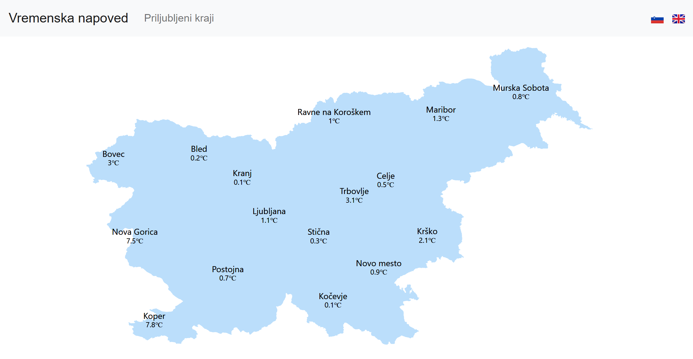
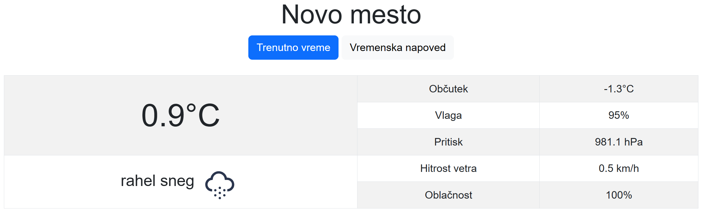
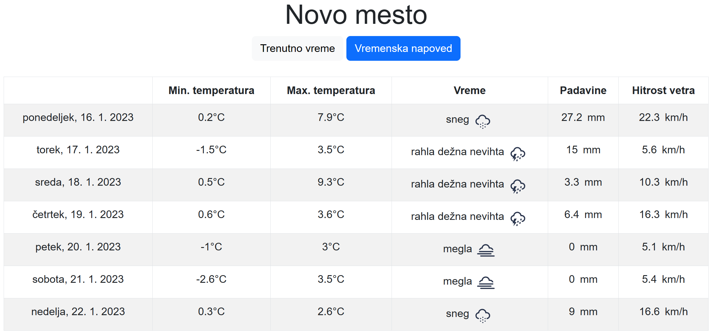
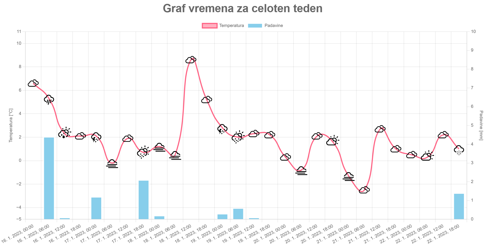
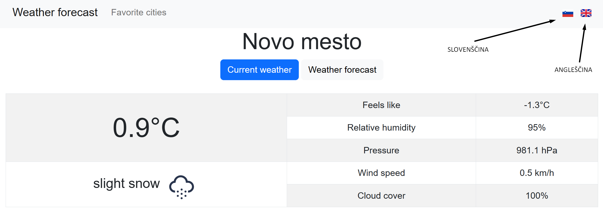
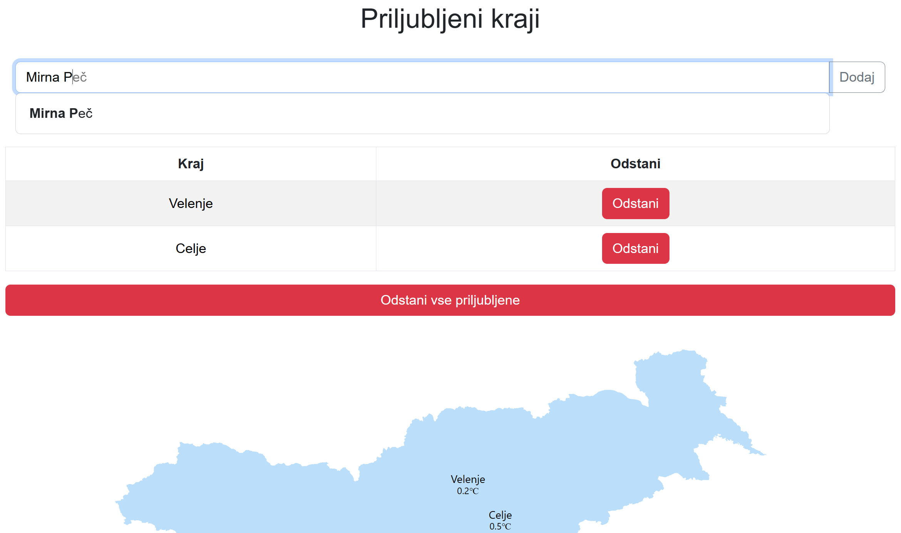

# WeatherAPP
Projekt razvili: Danijel Mestnik, Aljaž Blatnik in Ema Koncilija

Mentor: asist. dr. Albert Zorko

[Fakulteta za informacijske študije v Novem mestu](https://www.fis.unm.si/), [magistrski program Računalništvo in spletne tehnologije](https://www.fis.unm.si/studijski-programi/racunalnistvo-in-spletne-tehnologije-mag/) (2. stopnja)

Predmet: Razvoj programske opreme

Študijsko leto: 2022 / 2023

# Namen aplikacije

Namen aplikacije WeatherAPP je prikaz vremena posameznih krajev v Sloveniji. Uporabnik ima na voljo standardne vnaprej definirane kraje, vendar pa lahko s pomočjo funkcionalnosti priljubljenih mest dodaja tudi lastne kraje oziroma lokacije.

# Uporabljene tehnologije

Za razvoj so bile uporabljene spodaj opisane tehnologije.

## React

[React](https://reactjs.org/) je brezplačna in odprtokodna JavaScript knjižnica za gradnjo uporabniških vmesnikov. 

## Open-meteo API

[Open-Meteo](https://open-meteo.com/) je odprtokodni vremenski API z brezplačnim dostopom za nekomercialno uporabo. Omogoča pregled vremena vsako uro za 7 dni v tednu. Podatke pridobi iz državnih vremenskih služb, vremenski modeli pa uporabljajo meritve v realnem času, podatke letal, boje (na morjih in oceanih), dežne radarje in satelitska opazovanja za prikaz numeričnih vremenskih napovedi. Ponuja pa tudi napovedi za sončno sevanje, vetrove na višji nadmorski višini, transpiracijo, vlažnost tal, temperaturo tal, valove in kakovost zraka.

## NODE.JS

[NODE.JS](https://nodejs.org/en/) je odprtokodno strežniško okolje za več platform, ki deluje na sistemih Windows, Linux, Unix, macOS in drugih. NODE.JS je backend izvajalno okolje JavaScript, ki ga poganja V8 JavaScript Engine in izvaja kodo JavaScript zunaj spletnega brskalnika.

## Knjižnice

### React Simple Maps

Glavni namen knjižnice [React Simple Maps](https://www.react-simple-maps.io/) je, da poenostavi delo z zemljevidi SVG v Reactu. Obvladuje naloge kot so premikanje, povečava ter preprosta optimizacija upodabljanja. Izkorišča prednosti delov [d3-geo](https://github.com/d3/d3-geo) in [topojson-client](https://github.com/topojson/topojson-client) namesto tega, da se zanaša na celotno [knjižnico d3](https://d3js.org/). Knjižnica razkriva nabor komponent, ki jih je moč kombinirati za ustvarjanje zemljevidov SVG z oznakami in opombami. Če želimo uporabiti zemljevid, moramo zagotoviti sklic na veljavno [TopoJSON](https://github.com/topojson/topojson) datoteko. Za razvoj aplikacije je bil uporabljen [zemljevid Slovenije v TopoJSON formatu](https://github.com/cufarvid/slovenia-topo).

Za namestitev knjižnice se uporabi ukaz `npm install --save react-simple-maps`.

### Weather Icons React

Namen knjižnice [Weather Icons React](https://react-icons.github.io/react-icons/icons?name=wi) je zagotavljanje sličic za prikaz posameznega stanja vremena v aplikaciji. Knjižnica vsebuje ikone za prikaz standardnih vremenskih stanj ter tudi nekatere ikone za ekstremne vremenske pojave (poplava, orkan, tornado in podobne). Prav tako se lahko uporabi ikone za dan in noč (ikone, ki prikazujejo vremenske pojave za dan, vsebujejo sonce, medtem ko ikone, ki prikazujejo vremenske pojave za noč, vsebujejo luno).

Za namestitev knjižnice se uporabi ukaz `npm install weather-icons-react --save`.

### Charts.js

[Charts.js](https://github.com/chartjs/Chart.js) je najbolj popularna knjižnica grafikonov za razvoj aplikacij v JavaScriptu. Knjižnica ponuja nabor pogosto uporabljenih vrst grafikonov, vtičnikov in možnosti prilagajanja. Poleg nabora vgrajenih vrst grafikonov se lahko uporabi tudi dodatne vrste grafikonov, ki jih vzdržuje skupina razvijalcev (skupnost). Prav tako je možno združiti več vrst grafikonov v mešani grafikon (to je mešanje več vrst grafikonov v enega na istem platnu). Knjižnica ima vgrajene tudi animacije za prikaz grafikonov.

Za namestitev knjižnice se uporabi ukaz `npm install chart.js`.

### React Charts 2

[React Charts 2](https://www.npmjs.com/package/react-chartjs-2) je razširitev knjižnice Charts.js. 

Za namestitev knjižnice se uporabi ukaz `npm i react-chartjs-2 chart.js`.

### Bootstrap

[Bootstrap](https://getbootstrap.com/) je najbolj priljubljeno HTML, CSS in JavaScript ogrodje za razvoj odzivnih, mobile-first spletnih mest. Ogrodje je povsem brezplačno za uporabo. Razvijalci, ki uporabljajo Bootstrap, lahko gradijo spletna mesta veliko hitreje, ker jim je prihranjena skrb glede osnovnih ukazov in funkcij.

# Namestitev aplikacije

Naprava, na kateri je bila aplikacija uspešno preizkušena, je imela naslednje komponente:
- Procesor: Intel Core i7-10700 @ 2.9 GHz
- Grafična kartica: EVGA Nvidia Geforce RTX 3070
- Nameščen pomnilnik RAM: 32 GB
- Operacijski sistem: Windows 10 Pro (različica 21H2) 64-bitni

Aplikacija je bila uspešno preizkušena na naslednjih brskalnikih:
- [Google Chrome](https://www.google.com/chrome/) (uradna različica 109.0.5414.75), 64-bitno
- [Microsoft Edge](https://www.microsoft.com/en-us/edge?form=MA13FJ) (uradna različica 109.0.1518.52), 64-bitno

V nadaljevanju sledi potek namestitve aplikacije za operacijski sistem Windows.

## Namestitev NODE.JS

1. Obiščemo spletno mesto [NodeJS.org](https://nodejs.org/en/ )
2. Prenesemo željeno različico, ki je primerna za naš sistem
3. Odpremo namestitveni program in sledimo navodilom

Namestitveni program Node.js

1. Na prvem oknu (pri opisu namestitvenega čarovnika) kliknemo možnost za naprej
2. Se strinjamo z licenčnimi pogoji in nadaljujemo do naslednjega okna
3. Izberemo lokacijo namestitve Node.js in nadaljujemo do naslednjega okna
4. Na oknu lahko izberemo možnost namestitve določenih funkcionalnosti, v našem primeru pustimo privzete nastavitve in nadaljujemo do naslednjega okna
5. Na oknu lahko izberemo, da se potrebni moduli (kot so [Python](https://www.python.org/downloads/) in [Visual Studio Build Tools](https://visualstudio.microsoft.com/downloads/?q=build+tools)) samodejno namestijo v primeru, da še niso nameščeni, lahko pa jih namestimo sami in nadaljujemo do naslednjega okna
6. Potrdimo namestitev in počakamo, da se Node.js namesti
7. Ko je namestitev končana, znova zaženemo računalnik oziroma napravo

Preverjanje uspešnosti namestitve

1. Pritisnemo kombinacijo tipk Windows + X
2. Izberemo opcijo zaženi (angl. Run)
3. V vrstico vpišemo besedno zvezo "cmd"
4. Vnesemo ukaz `node -v`
5. V primeru, da ukazni poziv vrne trenutno različico, je bil Node.js uspešno nameščen

Navodila s slikovnim materialom in za preostale operacijske sisteme so dostopna [tukaj](https://radixweb.com/blog/installing-npm-and-nodejs-on-windows-and-mac#windows).

## Prenos GitHub datoteke

1. Obiščemo spletno mesto [GitHub datoteke](https://github.com/ABlatnik5/WeatherAPP_2023 )
2. Prenesemo (Download ZIP) ali kloniramo datoteko
3. V primeru, da prenesemo datoteko v ZIP formatu, razširimo ZIP datoteko na poljubno lokacijo
4. Po želji lahko celotno datoteko WeatherAPP-main premaknemo v poljubno mapo
5. Lokacijo datoteke WeatherAPP-main si zapišemo ali zapomnemo

Navodila s slikovnim materialom so dostopna [tukaj](https://docs.github.com/en/repositories/creating-and-managing-repositories/cloning-a-repository).

## Zagon projekta

1. Pritisnemo kombinacijo tipk Windows + X
2. Izberemo opcijo začeni (angl. Run)
3. V vrstico vpišemo besedno zvezo "cmd)
4. Premaknemo se na particijo, kjer se nahaja WeatherAPP-main datoteka, tako da vpišemo črko particije in dvopičje
5. Z ukazi cd se premaknemo v mapo, kjer je shranjena datoteka WeatherAPP-main
6. Uporabimo ukaz `npm install` in počakamo, da se izvede
7. Ko se ukaz izvede, uporabimo ukaz `npm start`
8. Ko se ukaz `npm start` izvede do konca, se nam samodejno odpre spletno okno z aplikacijo
9. V primeru, da se ne zgodi nič, v naslovno vrstico poljubnega brskalnika vpišemo naslov `localhost:3000`

Navodila v obliki videa so dostopna [tukaj](https://youtu.be/9zMWXD-xoxc).

Navodila s slikovnim materialom so dostopna [tukaj](https://www.lifewire.com/change-directories-in-command-prompt-5185508)

# Funkcionalnosti aplikacije

Spodaj so predstavljene funkcionalnosti razvite aplikacije.

## Prikaz vremena v Sloveniji

Prva stran prikazuje trenutne temperature v vnaprej definiranih mestih po Sloveniji. Prikazana so pomembnejša mesta v posamezni regiji. Za podroben prikaz vremena se lahko pritisne na ime mesta in tako se odpre nova stran, ki vsebuje bolj podrobne informacije glede vremena v željenem kraju.

## Trenutno vreme

Če pritisnemo na mesto, se nam odpre nova stran, ki vsebuje podrobne informacije. Med te informacije sodi trenutna temperatura, prikazani pa so tudi naslednji parametri:
- Občutek (prikazan v stopinjah celzija)
- Vlaga (prikazana v odstotkih)
- Pritisk (prikazan v hPa)
- Hitrost vetra (prikazana v km/h)
- Oblačnost (prikazana v odstotkih)

Pod prikazom trenutne temperature na levi strani okna pa je prikazano tudi trenutno vreme. Za lažje razumevanje je poleg naziva vremena tudi ikona.

## Vremenska napoved

Vremenska napvoed predstavlja drugega izmed podoken (podokni sta trenutno vreme in vremenska napoved) podrobnega opisa vremena v določenem kraju. Pri prikazu lahko vidimo podrobne informacije o vremenu za nadaljnjih 7 dni (vključuje trenutni dan). Prikazani so naslednji podatki:
- Dan in datum (naziv dneva z datumom v formatu DD/MM/YYYY)
- Minimalna temperatura tekom dneva (v stopinjah celzija)
- Maksimalna temperatura tekom dneva (v stopinjah celzija)
- Vreme (naziv vremena z ikono)
- Padavine (v milimetrih)
- Hitrost vetra (v km/h)

## Grafičen prikaz vremena

Podrobni vremenski podatki so prikazani tudi grafično (graf za trenutno vreme in graf za vremensko napoved). Na sliki je viden graf vremenske napovedi za trenutni teden. Rdeča linija predstavlja nihanje temperature, za določen interval (na vsake 3 ure) pa je prikazano tudi vreme v obliki ikone. Modri stolpci predstavljajo nivo padavin v milimetrih. Na dnu lahko vidimo tudi datum in uro. Graf je tudi interaktiven. V primeru, da se s kazalcem dotaknemo ikone vremena, nam je v kvadratku prikazan tudi naziv vremena, hkrati pa je prikazana tudi temperatura ter trenutni datum. Če se dotaknemo stolpca, se nam pokaže točna vrednost padavin v milimetrih za izbran datum in čas.

## Izbira jezika

Aplikacija je prevedena v dva jezika (angleščina in slovenščina). Med prevodi izbiramo s klikom na zastavo, ki željen jezik predstavlja. Prevedeni so vsi elementi strani. V primeru, da se ob spremembi jezika nahajamo na strani, ki vsebuje graf, pa lahko opazimo tudi animacijo pri prikazu grafa.

## Priljubljeni kraji

V aplikaciji lahko dodajamo in odstranjujemo tudi priljubljene kraje. Ko je dodan nov kraj, se ta prikaže na zemljevidu pod seznamom priljubljenih mest. Ko kraj odstranimo, se ta izbriše tudi iz zemljevida. Tako kot na prvi strani, lahko tudi tukaj kliknemo na kraj v seznamu ali pa na zemljevidu, če želimo bolj podroben prikaz priljubljenega kraja. Za seznam obstoječih krajev, ki jih lahko uporabnik najde, je bil uporabljen seznam dostopen na spletnem mestu SimpleMaps (seznam se nahaja [tukaj](https://simplemaps.com/data/si-cities)). Seznam je nadgrajen in popravljen tam, kjer je bilo to potrebno.
